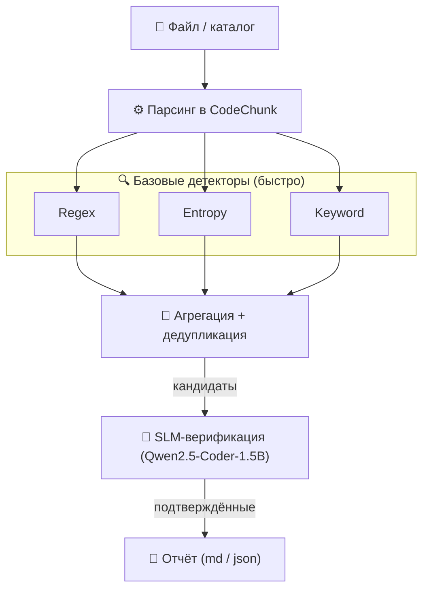

# 🔍 SLM Secret & Insecure Code Scanner

<p align="center">
  
  
  
  
</p>

Статический анализатор кода (SAST), объединяющий классические детекторы (regex,
энтропийный анализ, контекстный поиск) с **обученной малой языковой моделью**
(Qwen2.5-Coder-1.5B-Instruct) для поиска **утечек секретов** и **небезопасного кода**
в Python и C.

Ключевая идея — **каскадная архитектура**: быстрые базовые детекторы находят
кандидатов, а SLM верифицирует их и отсекает ложные срабатывания.

---

## 📊 Главный результат

Сравнение базового сканера и каскада на независимом тестовом датасете
(527 примеров, 11 классов):

| Метрика | Только baseline | **Каскад (+SLM)** | Изменение |
|---|:---:|:---:|:---:|
| Precision | 0.7346 | **0.9942** | +0.260 |
| Recall | 0.7668 | **1.0000** | +0.233 |
| F1-score | 0.7504 | **0.9971** | +0.247 |
| **FPR (ложные срабатывания)** | **0.5163** | **0.0109** | **−47×** |
| FNR (пропуски) | 0.2332 | **0.0000** | −100% |

> ✅ **Гипотеза подтверждена:** доля ложных срабатываний снижена в **47 раз**
> при сохранении **100% полноты** обнаружения.

---

## ✨ Возможности

- **11 классов обнаружения:** 6 типов секретов + 5 типов небезопасного кода
- **3 базовых детектора:** 30+ regex-правил, энтропия Шеннона, контекстный поиск
- **Каскадная верификация:** обученная модель (3 эпохи, 3481 пример обучения)
- **Объяснимые срабатывания:** модель объясняет, почему код проблемный
- **Рекомендации по исправлению** для каждого типа находки
- **Форматы отчётов:** текст, JSON, Markdown
- **Docker-контейнер:** полностью воспроизводимый запуск без установки окружения
- **Поддержка языков:** Python и C

---
## 🏗 Архитектура


**Почему каскад, а не только модель?**

| Аспект     | Только модель             | Каскад                             |
| ---------- | ------------------------- | ---------------------------------- |
| Скорость   | ~5 сек на каждый фрагмент | модель проверяет только кандидатов |
| Точность   | Высокая                   | Высокая + дедупликация             |
| Надёжность | Возможны «галлюцинации»   | детерминированный первичный фильтр |

---

## 🚀 Быстрый старт

### Способ 1: Docker (рекомендуется)

Не требует установки Python и зависимостей. Понадобится только
[Docker Desktop](https://www.docker.com/products/docker-desktop/).

**1. Соберите образ:**

```bash
docker build -t slm-scanner:latest .
```
⏱ Первая сборка займёт **15–20 минут** (установка зависимостей + копирование модели ~3 ГБ). Повторные сборки используют кеш и занимают 1–2 минуты.

**2. Запустите сканирование:**

```bash
docker run --rm slm-scanner:latest
```

По умолчанию сканируется `examples/example_repo` с каскадом и сохранением отчёта внутри контейнера.

**3. Сохраните отчёт на свой компьютер:**

```powershell
docker run --rm -v ${PWD}/reports:/app/reports slm-scanner:latest scan examples/example_repo --with-slm --format markdown --out reports/report_docker.md
```

После этого отчёт появится в папке `reports/` на вашем диске.

> ⚠️ **Для Windows:** если команда с переносом строк через `\` не работает в PowerShell, используйте **обратный апостроф** `'` или пишите всё одной строкой:
> `docker run --rm -v ${PWD}/reports:/app/reports slm-scanner:latest ' scan examples/example_repo --with-slm --format markdown --out reports/report_docker.md

### Способ 2: Локальная установка
```bash
# Клонируйте репозиторий
git clone https://github.com/Sterben02/SLM-project.git
cd SLM-project

# Создайте и активируйте виртуальное окружение
python -m venv venv

# Windows (PowerShell):
venv\Scripts\activate
# Windows (Git Bash):
source venv/Scripts/activate
# Linux / macOS:
source venv/bin/activate

# Установите зависимости
pip install -r requirements.txt```
```
⚠️ Для работы `--with-slm` в папке `models_cache/` должны находиться базовая модель и адаптеры. Подробнее — раздел «Модели».

---
## 🐳 Подробная инструкция по Docker

### Сборка образа
```bash
docker build -t slm-scanner:latest .
```

Проверить, что образ создан:

```bash
docker images slm-scanner
```

Ожидаемый вывод:
```
IMAGE                TAG      DISK USAGE   CONTENT SIZE
slm-scanner          latest   12.1GB       5.2GB
```
### Основные команды запуска

| Команда                                                                             | Что делает                      |
| ----------------------------------------------------------------------------------- | ------------------------------- |
| `docker run --rm slm-scanner:latest`                                                | Полный каскад на `example_repo` |
| `docker run --rm slm-scanner:latest scan examples/example_repo_c`                   | Сканировать C-репозиторий       |
| `docker run --rm slm-scanner:latest scan <путь> --format json --out reports/r.json` | JSON-отчёт                      |
| `docker compose up --build`                                                         | Запуск через docker-compose     |

### Сохранение отчёта на хост

Флаг `-v` монтирует вашу папку `reports/` внутрь контейнера:

```bash
docker run --rm -v ${PWD}/reports:/app/reports slm-scanner:latest scan examples/example_repo --with-slm --format markdown --out reports/report_docker.md
```

Просмотр результата:

```bash
ls reports/report_docker.md
```

### Проверка воспроизводимости

Запустите одну команду дважды и сравните результаты:

```bash
docker run --rm slm-scanner:latest scan examples/example_repo > run1.txt
docker run --rm slm-scanner:latest scan examples/example_repo > run2.txt
fc run1.txt run2.txt    # Windows
# diff run1.txt run2.txt  # Linux / macOS
```

Вывод `различий не найдено` подтверждает, что развёртывание **полностью воспроизводимо**.

### Запуск через docker-compose

```bash
docker compose up --build
```

Отчёт сохраняется в `reports/report_docker.md`.

### Лёгкий образ (только базовые детекторы)

Если критичен размер (~200 МБ вместо 12 ГБ), используйте лёгкий образ без модели:

```bash
docker build -f Dockerfile.baseline -t slm-scanner:slim .
docker run --rm slm-scanner:slim scan examples/example_repo
```

### Технические детали образа

|Параметр|Значение|
|---|---|
|Базовый образ|`python:3.11-slim`|
|Полный размер|~12.1 ГБ|
|Размер в реестре (сжатый)|~5.2 ГБ|
|Инференс|**только CPU** (детерминированно и воспроизводимо)|
|Время загрузки модели|~30–60 сек|
|Время проверки 7 кандидатов|~1–3 мин|

## 💻 Использование CLI

### Синтаксис

```bash
python -m scanner scan [OPTIONS] PATH
```

| Опция            | Описание                   | По умолчанию        |
| ---------------- | -------------------------- | ------------------- |
| `PATH`           | Путь к файлу или папке     | (обязательно)       |
| `--format`, `-f` | `text`, `json`, `markdown` | `text`              |
| `--out`, `-o`    | Путь к файлу отчёта        | `reports/report.md` |
| `--with-slm`     | Включить каскад с моделью  | выкл.               |
### Примеры

```bash
# Только базовые детекторы (быстро)
python -m scanner scan examples/example_repo

# Полный каскад с моделью (точно)
python -m scanner scan examples/example_repo --with-slm

# JSON-отчёт
python -m scanner scan examples/example_repo --with-slm --format json --out report.json

# Markdown-отчёт
python -m scanner scan examples/example_repo --with-slm --format markdown --out report.md

# Сканировать отдельный файл
python -m scanner scan examples/example_repo_c/vulnerable.c --with-slm
```

### Пример вывода каскада

🤖 Каскад: baseline → проверка SLM
Сканирование... ━━━━━━━━━━━━━━━━━━━━━━━━━━━━━━━━━━━━━━━━ 100% 0:00:00
🤖 Загрузка SLM (cpu)...
✅ SLM загружена
🤖 SLM проверяет 1/7: examples/example_repo/config.py:5 (generic_api_key)
   ✅ Подтверждено
🤖 SLM проверяет 2/7: examples/example_repo/config.py:6 (password_in_code)
   ✅ Подтверждено
...
✅ Сканирование завершено
   Найдено срабатываний: 7
   • Секретов: 5
   • Небезопасного кода: 2

📝 Markdown-отчёт сохранён: reports/report_docker.md

---
## 🧠 Об обученной модели

|Параметр|Значение|
|---|---|
|Базовая модель|Qwen2.5-Coder-1.5B-Instruct|
|Метод дообучения|QLoRA (4-bit квантование + LoRA-адаптеры)|
|Датасет обучения|3481 пример (70/15/15)|
|Эпох|3|
|Итоговый eval loss|0.250|
|Обучаемые параметры|~1.2%|
|Размер адаптеров|~74 МБ|

Обучение проводилось на NVIDIA RTX 5060 (8 ГБ) и заняло ~1 час 15 минут.

### Размещение моделей

Для локального запуска `--with-slm` поместите в `models_cache/`:

models_cache/
├── qwen-base/                      # базовая модель
└── qwen-secret-scanner-lora/       # обученные адаптеры

В Docker-образе модели **уже встроены** при сборке.

---
## 🗂 Структура проекта

```
SLM-project/
├── scanner/                        # Ядро сканера
│   ├── cli.py                      # CLI (Typer)
│   ├── models/                     # Модель данных (Pydantic)
│   ├── detectors/                  # Базовые детекторы
│   │   ├── regex_detector.py
│   │   ├── regex_rules.py          # 30+ правил
│   │   ├── entropy_detector.py
│   │   └── keyword_detector.py
│   ├── core/
│   │   ├── scanner.py              # Обход файлов, парсинг
│   │   ├── aggregator.py           # Дедупликация
│   │   └── cascade.py              # SLM-верификация
│   ├── llm/
│   │   └── slm_detector.py         # Обёртка над моделью
│   └── utils/
│       └── recommendations.py      # Рекомендации по исправлению
├── scripts/                        # Утилиты
│   ├── train_sft.py                # Обучение модели
│   ├── prepare_sft_data.py         # Подготовка SFT-данных
│   ├── split_dataset.py            # Разбиение датасета
│   └── evaluate_slm.py             # Оценка метрик
├── data/                           # Датасет (3481 пример)
├── models_cache/                   # Модели (не в git)
├── examples/                       # Тестовые репозитории
│   ├── example_repo/               # Python
│   └── example_repo_c/             # C
├── reports/                        # Отчёты
├── Dockerfile                      # Полный образ (с моделью)
├── Dockerfile.baseline             # Лёгкий образ (без модели)
├── docker-compose.yml
├── requirements.txt                # Зависимости для локального запуска
└── requirements-docker-slm.txt     # Зависимости для Docker-образа
```
---

## 📦 Зависимости

### Локальный запуск (требует модель)

```bash
pydantic, typer, rich, torch, transformers, peft, accelerate, tiktoken
```

### Docker-образ (фиксированные версии)

```bash
torch==2.7.0 (CPU), transformers==5.15.0, peft==0.20.0,
pydantic==2.13.4, typer==0.27.1, rich==15.0.0, tiktoken==0.9.0
```

## 🔧 Решение типичных проблем

### 1. Кракозябры в выводе (вместо кириллицы — `рџ”Ќ`)

Это проблема отображения терминала, а не ошибка работы. В PowerShell выполните:

```bash
[Console]::OutputEncoding = [System.Text.Encoding]::UTF8
chcp 65001
```

После этого вывод будет читаемым.

### 2. `No such command '\'` в PowerShell

PowerShell использует `` ` `` (обратный апостроф) для переноса строк, а не `\`. Пишите команду **одной строкой** или используйте `` ` ``.

### 3. `failed to read dockerfile: no such file or directory`

Файл `Dockerfile` создан как `Dockerfile.txt` (Блокнот добавил расширение). Переименуйте:

```powershell
Move-Item Dockerfile.txt Dockerfile
```

### 4. `COPY models_cache/... not found` при сборке

Убедитесь, что папки моделей существуют и не пусты:

```bash
ls models_cache/qwen-base
ls models_cache/qwen-secret-scanner-lora
```

### 5. `ModuleNotFoundError: torch`

Не активировано виртуальное окружение:

```bash
source venv/Scripts/activate    # Windows Git Bash
venv\Scripts\activate           # Windows PowerShell
source venv/bin/activate        # Linux/macOS
```

### 6. Docker Desktop не запускается

Убедитесь, что:
- включён движок (зелёный индикатор в трее);
- установлен и обновлён WSL 2 (`wsl --update`);
- в BIOS включена виртуализация (VT-x / AMD-V).

---
## ⚠️ Ограничения

1. **Каскад зависит от базовых детекторов.** Если ни один детектор не нашёл кандидата — модель его не проверит. Новые классы уязвимостей требуют добавления правил.
2. **Скорость модели.** Каждый вызов — ~1–3 сек на CPU. Для крупных репозиториев используйте пакетный запуск.
3. **Языки.** Модель обучена на Python и C; другие языки требуют дообучения.
4. **Контекст.** Модель получает фрагмент и ~3 строки контекста; сложные многофайловые случаи могут потребовать ручного анализа.
5. **Инференс в Docker — только CPU.** Это сделано намеренно для воспроизводимости и независимости от железа хоста.
---
## 🧪 Тестовые примеры

### `examples/example_repo` (Python)

Содержит секреты и небезопасные конструкции:
```python
API_KEY = "sk-live-abc123def456ghi789jkl012mno345"   # секрет
PASSWORD = "SuperSecret123!"                          # секрет
subprocess.run(cmd, shell=True)                       # инъекция команд
result = eval(user_input)                             # выполнение кода
```

Ожидаемый результат каскада: **7 подтверждённых срабатываний** (5 секретов + 2 небезопасных).

### `examples/example_repo_c` (C)

```c
char* api_key = "sk-proj-1234567890abcdef";   // секрет
sprintf(cmd, "echo %s", input);               // небезопасно
system(cmd);                                  // инъекция
gets(buf);                                    // переполнение буфера
```

Ожидаемый результат каскада: **5 подтверждённых срабатываний**.
